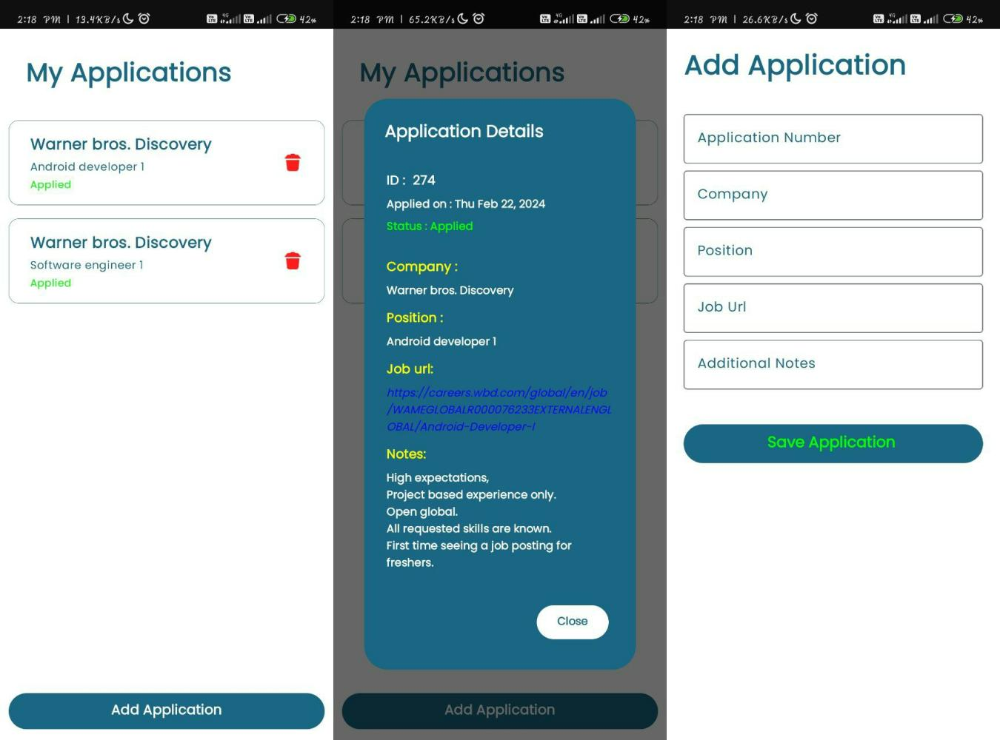

## AppliTracker

Welcome to AppliTracker, your go-to application for tracking and managing Job applications! 

## Overview

AppliTracker is a Native mobile application developed using Kotlin, Jetpack Compose, Room and Material 3 for a seamless and modern user experience. 
Keep all your job applications organized and easily navigate through them with the integrated Navigation Compose.

## Features

✨ **Room SQLite:** Utilizes Room Persistence Library for efficient local data storage and retrieval.

🎨 **Jetpack Compose:** Embrace the power of modern UI development with Jetpack Compose for a delightful user interface.

🌈 **Material 3 Design:** Immerse yourself in a visually appealing and intuitive design using Material 3 components.

🗺️ **Navigation Compose:** Effortlessly navigate through different sections of the application with Navigation Compose.

## Getting Started

To run AppliTracker locally, follow these simple steps:

1. Clone the repository:
   ```bash
   git clone https://github.com/Rahulbalakrishnan/AppliTracker.git
   ```

2. Open the project in Android Studio or your preferred IDE.

3. Build and run the application on your emulator or physical device.

4. Explore the features and manage your job applications effectively!



